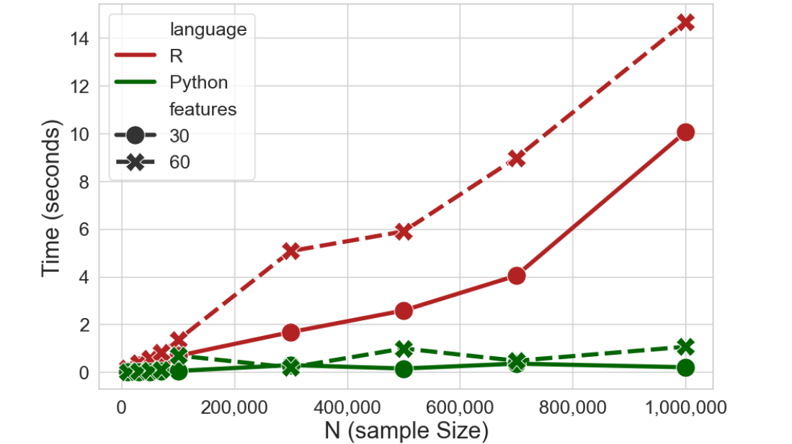
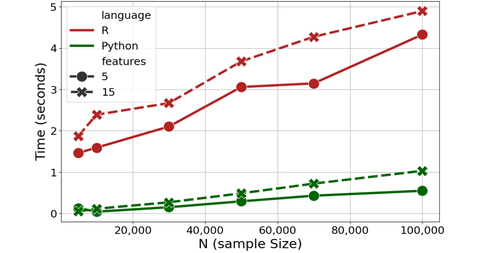
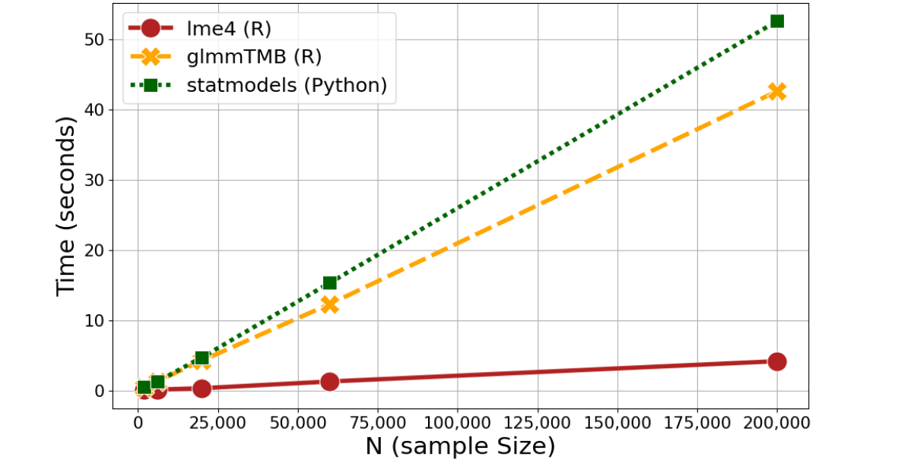
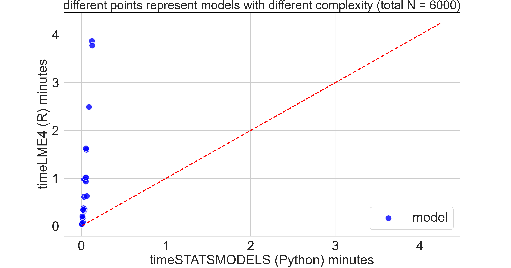
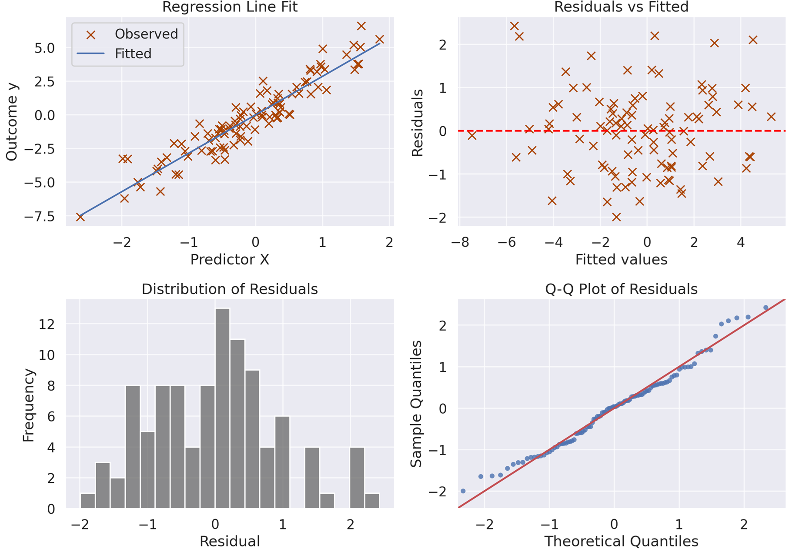
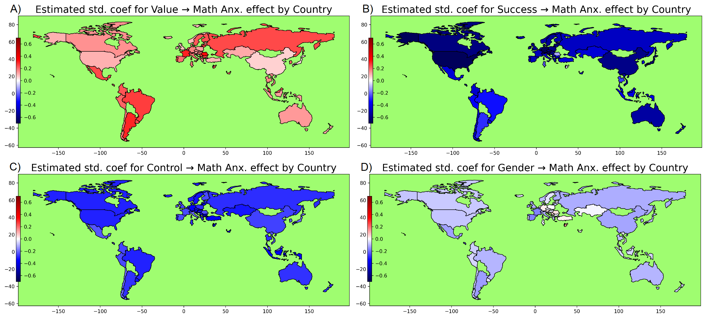
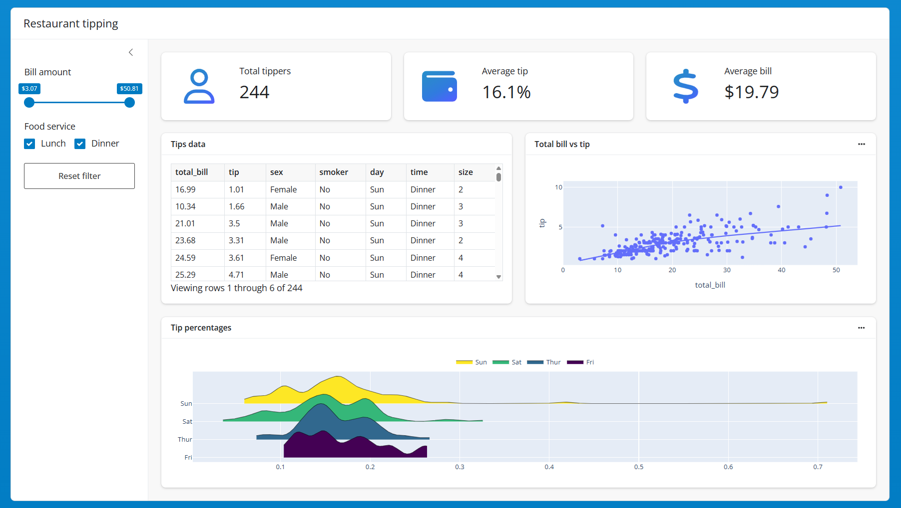
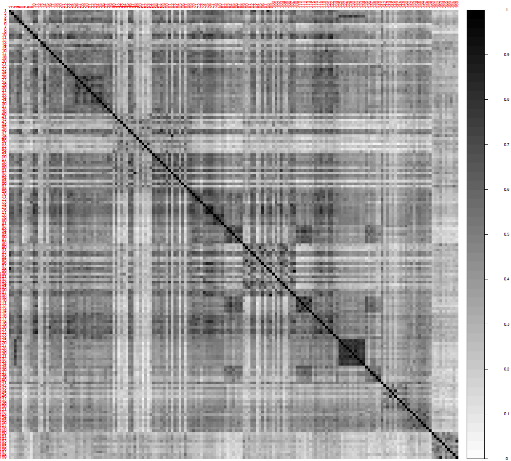
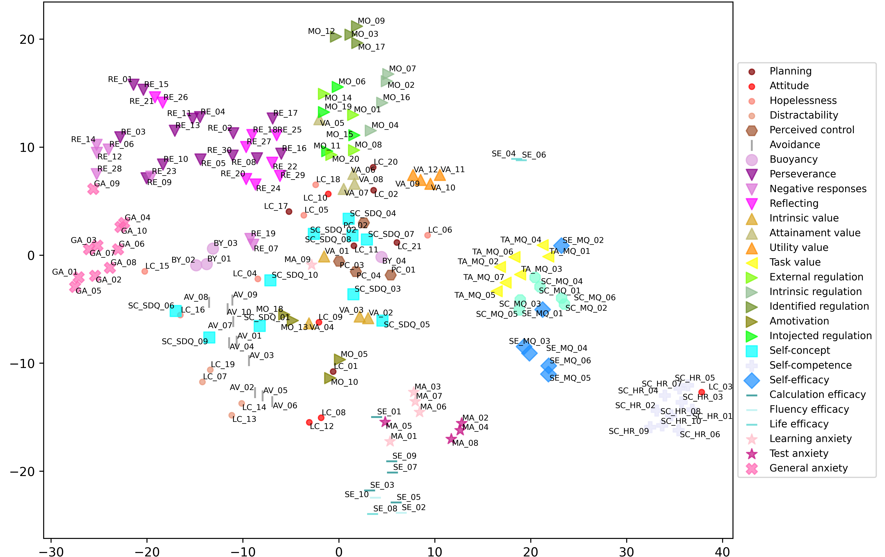
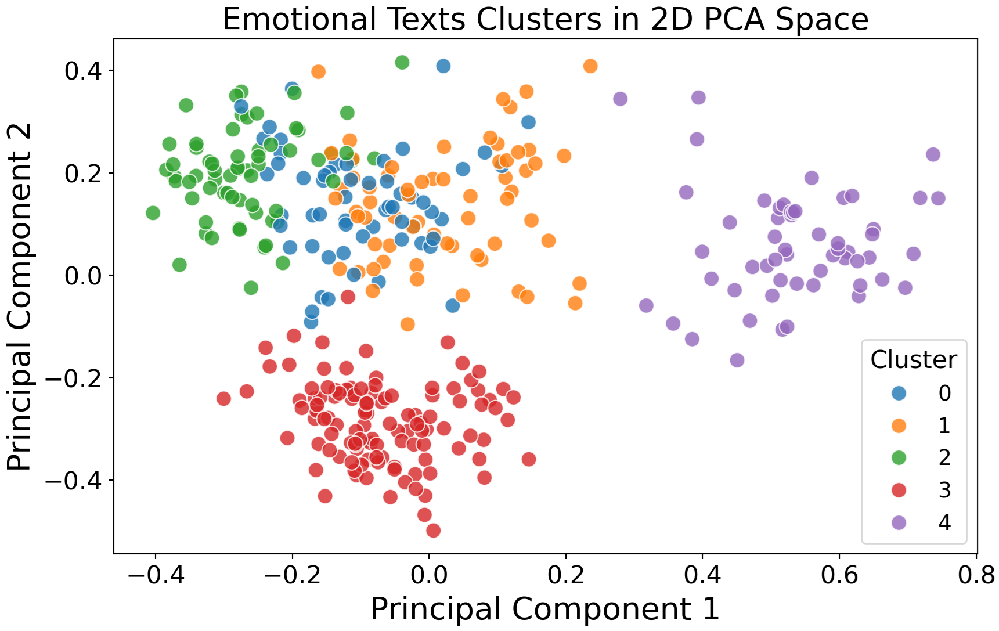

```{r, echo=F, include=F}
reticulate::use_python("C:/Users/enric/AppData/Local/Programs/Python/Python313/python.exe")
reticulate::repl_python()
```

## Why learning Python?

<div style="font-size:30px;">
- **Ultra mainstream and global leader in programming and data science!** <a href="https://www.tiobe.com/tiobe-index/" target="_blank">Most used programming language in the world</a>; extremely used in industry, but also increasingly adopted in academia. *Huge job market advantage as a data scientist, inside but especially outside academia!*
- **Huge community & ecosystem**:  >600,000 packages on PyPI! (more than 30x compared to R);
- **Free & open-source**, like R... wherever you go, Python will be with you, for free!
- **Great for reproducibility**: like R, it integrates well with *GitHub*, *Quarto*, *Jupyter*, *RStudio*, *R* itself, and more; allows you to create reports, articles, books, web apps, experiments... A great tool for Open Science!
- **Strong programming language**, considered easier to read than R, and very widely used beyond statistical analysis (e.g., developing web apps, machine learning, deep learning & AI, programming experiments)
</div>

## What you may expect to learn in this course

<div style="font-size:38px;">
- Running fundamental operations and using core functions; 
- Working with basic data types and structures (`list`, `dict`, `DataFrame`); 
- Learning a bit of data manipulation for data science with `Pandas` and `NumPy`; 
- Learning fundamental programming tools: loops, conditionals, custom functions; 
- Brief overview of fancy stuff with machine learning, deep learning, natural language processing, experiment programming
</div>

## Why should you use Python, later in your PhD?

I don't recommend using Python for doing the exact same things you could do with R. R is much more used in this PhD program and generally for statistical analysis in academia. 

So why learning Python? Apart from its importance for "outside academia", you could learn Python for your PhD for: 

1) Advanced applications of **AI**: **pretrained models**, **Natural Language Processing** (e.g., sentiment analysis, text classification, embeddings); 
2) **Computational efficiency** especially when handling **big data**; 
3) **Behavioral experiment** (e.g., PsychoPy, OpenSesame are becoming widely used in cognitive science). 

## Python vs R (for us): Different Strengths

<div style="font-size:28px;">
| Task                           | R                           | Python                              |
| ------------------------------ | --------------------------------- | ----------------------------------- |
| Data management for data science   | ✅ `base`, `dplyr`, `tidyverse`; base R more specialized for statistics and data analysis    | ✅ `pandas`, `numpy`; very flexible; more scalable on big data            |
| Visualization                  | ✅ `ggplot2` ♥️             | ✅ `matplotlib`, `seaborn`           |
| Statistical modeling | ✅ `base`, `lme4`, `glmmTMB`, `mgcv`, `lavaan`, ... ♥️ 🏆 | ⚠️ many alternatives, but generally less flexible       |
| Advanced machine learning               | ⚠️ `caret`, `mlr3`          | ✅ `scikit-learn`, industry standard |
| Deep learning & Natural Language Processing AI  | ❌ Limited, maybe `nnet`, `neuralnet`      | ✅ `transformers`, `keras`, `torch`; Hugging Face platform ♥️  🏆|
| Behavioral experiments         | ❌ Practically absent        | ✅ `PsychoPy`, `OpenSesame`          |
</div>

##  Python vs R (for us): increasingly integrated

In fact, Python and R are becoming increasingly integrated, and often used together in research. For example:

- You can use Python in R using `reticulate` and R in Python using `rpy2`;
- *RStudio* and *Quarto* can run Python script and chunks;
- *Jupyter* and *Colab* now allow R kernels;
- `shiny` and `ggplot` exist also for Python;
- `keras` and `tensorflow` can be used in R via `reticulate`; 
- `ellmer` allows you to use LLMs (including ChatGPT via API!) from inside R;
- `lme4` can be used inside Python via `pymer4`;
- SEM can be run in Python using `semopy` (similar to `lavaan`)


##  Python vs R Efficiency: Logistic Regression

<details>
<summary><strong>Some explanation (click to expand)</strong></summary>
For R the base `glm()` function was used; for Python `LogisticRegression()` from the `sklearn.linear_model` module was used
</details>

<div style="text-align: center;">
  
</div>


##  Python vs R Efficiency: GMM

<details>
<summary><strong>Some explanation (click to expand)</strong></summary>
Gaussian Mixture Models is a type of model-based clustering; for R `Mclusts()` from the `mclust` package was used; for Python `GaussianMixture()` from the `sklearn.mixture` module was used
</details>

<div style="text-align: center;">
  
</div>


##  Python vs R Efficiency: Mixed-effects models

<details>
<summary><strong>Some explanation (click to expand)</strong></summary>
For R, `lmer()` and `glmmTMB()` from the `lme4` and `glmmTMB` packages were used; for Python `mixedlm()` from the `statsmodels.formula` submodule was used
</details>

<div style="text-align: center;">
  
</div>


##  Python vs R Efficiency: Mixed-effects models

<details>
<summary><strong>Some explanation (click to expand)</strong></summary>
Each blue dot is a model with a randomly defined complexity (from 1 to 15 terms, both fixed and random, ranging from main effects to 4-way interactions)
</details>

<div style="text-align: center;">
  
</div>


##
### Data visualization with `seaborn`

<div style="text-align: center;">
  
</div>

##
### Data visualization with `matplotlib`

<div style="text-align: center;">
  
</div>

##
### Interactive Data visualization with `plotly`

<iframe src="figures/examplePlotlyOnnvll.html"
        style="width:1000px; height:600px; border:none;"
        scrolling="no"></iframe>

##
### Shiny app with Python

<div style="text-align: center;">
  <a href="https://shiny.posit.co/py/" target="_blank"></a>
</div>

##
### Image Classification with AI models via `transformers`

::: columns
::: {.column width="70%"}
<div style="text-align: center;">
  
</div>
:::
::: {.column width="30%"}
<div style="font-size:22px;">
free model used: <br/>`"microsoft/resnet-18"`
</div>
:::
:::

```{python}
#| echo: false
import pandas as pd
data = [
    {'label': 'water snake', 'score': 0.2936452627182007},
    {'label': 'Indian cobra, Naja naja', 'score': 0.28091076016426086},
    {'label': 'ringneck snake, ring-necked snake, ring snake', 'score': 0.16295978426933289},
    {'label': 'thunder snake, worm snake, Carphophis amoenus', 'score': 0.12134847044944763},
    {'label': 'hognose snake, puff adder, sand viper', 'score': 0.05200718343257904}
]
df = pd.DataFrame(data)
df['score'] = df['score'].round(4)
print(df.to_string(index=False))
```


##
### Text Classification with AI models via `transformers`

::: columns
::: {.column width="60%"}
<div class="large-code">
<em>
```
"That was absolutely terrifying. My hands were shaking, my heart pounded so loudly I could barely hear my own thoughts, and each creak of the floorboards seemed to scream danger. I stood frozen in place, staring at the door, every nerve in my body bracing for something awful to emerge from the darkness behind it"
```
</em>
</div>
:::
::: {.column width="10%"}
:::
::: {.column width="30%"}
<div style="font-size:22px;">
free model used: <br/>`"all-MiniLM-L12-v2"`
</div>
:::
:::

```{python}
#| echo: false
import pandas as pd
data = {'target': {0: 'fear', 1: 'disgust', 2: 'surprise', 3: 'sadness', 4: 'joy', 5: 'anger'}, 'cosineSimilarity': {0: 0.421103835105896, 1: 0.20817890763282776, 2: 0.16177059710025787, 3: 0.15281619131565094, 4: 0.12146811187267303, 5: 0.10975021123886108}}
df = pd.DataFrame(data)
df["cosineSimilarity"] = df["cosineSimilarity"].round(4)
print(df.to_string(index=False))
```

##
### Text transcription from audio using `transformers`
```python
from transformers import pipeline
whisperpipe = pipeline(model="openai/whisper-small")
whisperpipe("data/gelmanstats.mp3", return_timestamps=True)
```
```
Hi, my name is Andrew Gelman. I'm a professor of statistics and political science at Columbia. I've been teaching here since 1996. I'm always impressed that the students know more than I do about so many things. Just this morning, a graduate student came to me. He had been looking at data from ticketing, police moving violations. And there's this suspicion that the police have some sort of unofficial quota so that they're supposed to get a certain number of tickets by the end of the month. But you can look at the data and see whether you have more tickets at the very end of the month. He looked at something slightly different. He compared police that had had fewer tickets in the first half of the month to those who had more tickets and found that the ones who had fewer in the first half had a big jump in the second half of the month, which he attributed to a policy where the police don't have a quote of, but they do it comparatively. So if you've been ticketing fewer than other people in your precinct, then they hassle you and tell you you're supposed to do more. But we're still not quite sure. He was just telling me about this today. It's complicated because there could just be a variation. It could just be that the police who had more tickets in the first half have fewer in the second half just because it goes up and it goes down. and you happen to see that. So we have to do more, look at the data in different ways in order to try to understand, like to rule out different explanations for what's happening. I think that at least well it depends on what field you're working on. So if if someone's working, we have a student working on astronomy and there we're working with the astronomy professor David Shimonovich and it's It's very, it's necessary for us to combine our skills. So we have skills in visualizing data and fitting models and computation, but it's not like David Shimano, which gives us the data and we fit it. We have to work together in a collaboration. So that's sort of always the case, that we have to have a bridge connecting the applications to the modeling and the data. I think all the projects I've told you so far are exciting and interesting, and we're We're doing other things too. We have a paper called 19 Things We Learned From The 2016 Election. We're breaking down survey data, looking at how people voted, how young people and old people voted, comparing the gender gap among younger and older voters and among different ethnic groups. That's very challenging. Even if you have a big survey where you want to estimate small subgroups of the population, it requires some statistical modeling. Well, I think the polls were pretty good. They had Hillary Clinton ahead by getting about 52% of the two-party vote, and she actually got 51%, so that wasn't too bad. Polls are often some key states. I think that had to do with non-response, that people, certain Republicans who are not responding to polls in certain states. The way we can go forward is to do more adjustment of surveys. So it's harder and harder to reach people, so more and more adjustment needs to be done, but maybe surveys need to be adjusted also based on whether people are living in urban or rural areas and their partisanship and some other things. So one is never going to do perfect, but there's potential for improvement.
```

##
### Working with semantic embeddings using LLMs (extracted with OpenAI's `text-embedding-ada-002`)

<div style="text-align: center;">
  
</div>

##
### Working with semantic embeddings using LLMs (extracted with OpenAI's `text-embedding-ada-002`)

<div style="text-align: center;">
  
</div>

##
### Embeddings + Clustering, An exercise we will see 😉

<div style="text-align: center;">
  
</div>


<!-- --------------------------------------------------------------------- -->

