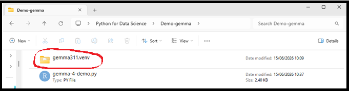
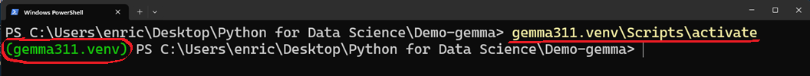
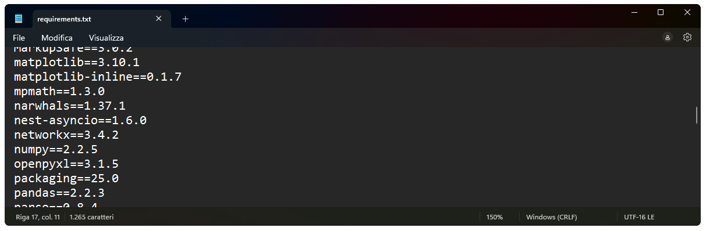
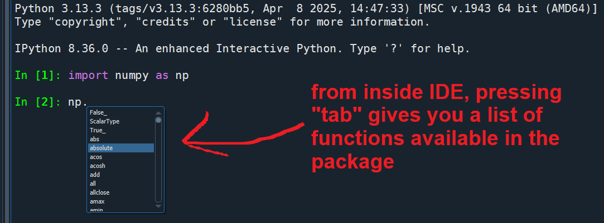
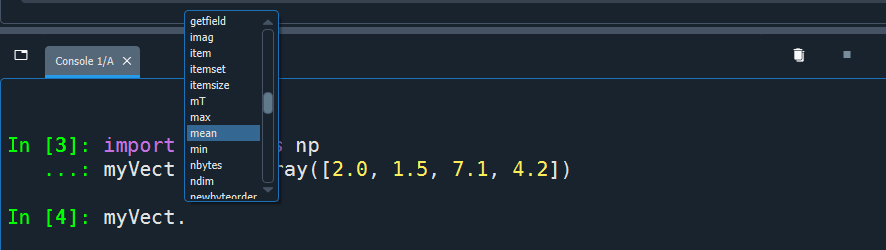

```{r, echo=F, include=F}
reticulate::use_python("C:/Users/enric/AppData/Local/Programs/Python/Python313/python.exe")
reticulate::repl_python()
```

## Virtual Environments

<div style="font-size:40px;">
→ **isolated Python environments** that allow you to install packages and dependencies **separately from your system/main Python installation**. Helps avoid conflicts across projects that may require different versions of the same packages. 

→ routinely used in professional projects, they are **best practice for managing projects ensuring <em>computational reproducibility</em>**

<em>btw something similar exists in R via the `renv` package, although unfortunately not widely used</em>
</div>

## Virtual Environments

<div style="font-size:35px;">
Practically, they are **local folders** with **an isolated Python environment**. They contain:

- a full copy of the **Python interpreter** / a symlink to the main Python installation;
- **all the packages you install** at the **exact versions** used at that time

This folder is ideally placed inside your project directory
</div>

<div style="text-align: center;">
  
</div>

<!------------------------------------------------------------------>

## Virtual Environments

Create a virtual environment with this command in your bash/terminal:

```{bash, eval=F}
python -m venv <nameOfVenv>
```

then, just before using, activate it:

```{bash, eval=F}
source <nameOfVenv>/bin/activate     # Linux/macOS

<nameOfVenv>\Scripts\activate        # Windows cmd / powershell
    # or alternatively
<nameOfVenv>\Scripts\activate.ps1    # Windows powershell
```

<div style="text-align: center;">
  
</div>

<div style="font-size:26px;">
... from inside an IDE, you may activate the `venv` via specific commands like `reticulate::use_virtualenv("nameOfMyVenv", required=T)` (in ***R / RStudio***), or setting the Python interpreter manually and then restarting the kernel (in ***Spyder***)
</div>

<!------------------------------------------------------------------>

## Virtual Environments

<div style="font-size:30px;">
- In your newly created **`venv`**, you **(re)install all packages required by your project**.
- Then, at any time, you can export a **`requirements.txt`** file to document the exact versions of all installed packages (this is particularly useful for sharing your environment, e.g., via *GitHub*).
- This is best practice to **isolate** projects and ensure **reproducibility**. 
</div>
```{bash, eval=F}
pip freeze > requirements.txt
```

<div style="text-align: center;">
  
</div>

<!------------------------------------------------------------------>

## Virtual Environments

<div style="font-size:34px;">
- Finally, if someone shares their project with you, or you re-install it on a different computer, you can simply create a new **`venv`**, activate it, and install all required packages at the exact versions specified in **`requirements.txt`**
</div>
```{bash, eval=F}
pip install -r requirements.txt

# alternatively 

python -m pip install -r requirements.txt
```

<!------------------------------------------------------------------>

## Project like a pro 😎

- Use a different **virtual environment** per project (as a subfolder);
- Place scripts, notebooks, and data in different subfolders;
- Use **relative paths** (e.g., `"data/myfile.csv"`);
- Save outputs, tables, figures... via code (not manually)

```csharp
myProjectFolder/
├── venv/             ← virtual environment
├── data/             ← .csv, .xlsx, etc.
├── scripts/          ← .py (also .R) scripts
├── outputs/          ← different types of output files
├── notebooks/        ← markdowns, colab notebooks, etc.
├── paper/            ← in case you are writing a paper...
├── tables/           ← possibly convenient to store paper's tables
├── figures/          ← possibly convenient to store paper's figures
├── requirements.txt  ← list of installed packages for reproducibility
└── README.md         ← brief description of the project
```

<!------------------------------------------------------------------>

## Installing and importing packages

Installing, inside an IDE console or Colab: 
```{python, eval=F}
!pip install numpy  # install one package
!pip install numpy pandas seaborn  # install multiple packages
!pip install numpy==2.2.5  # install package and specify which version 
!pip install -r requirements.txt  # install packages listed in requirements.txt
```

Then, before using any of their functions, import packages and modules:
```{python, eval=F}
import pandas as pd
import numpy as np
import seaborn as sns
import matplotlib.pyplot as plt
```

<div style="font-size:30px;">
"**`as`**" gives a shorter ***alias*** to a package or module name (e.g., `pd` for `pandas`; `np` for `numpy`); this is convenient because in Python you frequently need to call different functions by *always* specifying the package/module name (unlike in R; unless you import individual functions, e.g., `from numpy import array`)
</div>

<!------------------------------------------------------------------>

## Using functions, help, autocomplete

**Use** a function from a package, and call **help**:
```{python, eval=F}
np.mean([2.0, 1.5, 7.1, 4.2]) # call a function from a package
?np.mean      # help only in IDE console or Colab,         
help(np.mean) # help via built-in function
```

Use `tab` to **autocomplete and explore** available functions of a package ↴

<div style="text-align: center;">
  
</div>

<!------------------------------------------------------------------>

## Using functions, help, autocomplete

As in R, you can rely on positional order of arguments instead of naming them, or you can completely omit them if there are valid default arguments. However, it’s best practice to make all relevant arguments explicit for readability and reproducibility

<div class="large-code">
```{python, eval=F}
sns.regplot(data=myDF, x="Age", y="Score", scatter=True, ci=95)
plt.show()
```
</div>
<div style="text-align:center; max-width:70%;">
```{python, echo=F}
import seaborn as sns
import matplotlib.pyplot as plt
import numpy as np
import pandas as pd

plt.clf()
N = 100
Age = np.random.uniform(65,85,N)
Score = np.random.normal(100-Age/1.5,10,N)
df = pd.DataFrame({"Age":Age, "Score":Score})
pl = sns.regplot(data=df, x="Age", y="Score", 
                          scatter=True, ci=95)
pl.collections[0].set_alpha(0.8)
pl.collections[1].set_alpha(0.25)

plt.show()
```
</div>

<!------------------------------------------------------------------>

## Accessing functions as *methods*

In Python, objects may have functions *attached* to them: these are called **methods**, and are accessed using dot ("**`.`**") notation *(more on this later!)*

```{python}
import numpy as np
myVect = np.array([2.0, 1.5, 7.1, 4.2])
```

::: columns
::: {.column width="48%"}
<u>***Method-style syntax***</u>, requires that the object has this method:
<div class="large-code">
```{python}
myVect.mean()
```
</div>
:::
::: {.column width="4%"}
:::
::: {.column width="48%"}
<u>***Function-style syntax***</u> <br/> (more like R):
<div class="large-code">
```{python}
np.mean(myVect)
```
</div>
:::
:::

::: columns
::: {.column width="30%"}
<div style="text-align:right;">
<b>Use `tab` to autocomplete and explore available methods of an object →</b>
</div>
:::
::: {.column width="70%"}
<div style="text-align: center;">
  
</div>
:::
:::


<!------------------------------------------------------------------>

## Working directory

<div style="font-size:24px;">
Equivalent to R's `getwd()` / `setwd()`:
<div class="large-code">
```{python, eval=F}
import os

os.getcwd()               # Get current working directory
os.chdir("path/to/folder") # Change working directory
```
</div>
(in **Colab**, paths are relative to the notebook location in Google Drive)
</div>

<div class="large-code">
*Relative paths*
```{python, eval=F}
path = "myProjectFolder/"
path = "../myProjectFolder/"
```

*Absolute paths*
```{python, eval=F}
path = "C:/Users/enric/Desktop/myProjectFolder/" # windows-style
path = "/home/enric/Desktop/myProjectFolder/" # linux-style
path = "/Users/enric/Desktop/myProjectFolder/" # macOS-style
```
</div>

<!------------------------------------------------------------------>

##
### Import/Export objects <span style="font-size:32px;">*(no equivalent of `save.image()` of R)*</span>
```{python, eval=F}
myObject = [10.5, 2, 63.11]

import pickle

with open("myObject.pkl", "wb") as file:       # "wb" is for "writing"
    pickle.dump(myObject, file)                # Save an object 
    
with open("myObject.pkl", "rb") as file:       # "rb" is for "reading"
    myObject = pickle.load(file)               # Load & assign object 
```

*compact version*

```{python, eval=F}
pickle.dump(myObject, open("myObject.pkl", "wb")) # Save an object 

myObject = pickle.load(open("myObject.pkl", "rb")) # Load & assign object 
```

<div style="font-size:22px">
*(the compact version is suboptimal because it doesn't properly close the file after using, but still works)*
</div>

<!------------------------------------------------------------------>

## 
### Import tabular data (more on `pandas` later!)

from CSV
```{python, eval=F}
import pandas as pd

df = pd.read_csv("data/Courses40Cycle.csv")
```

from Excel
```{python, eval=F}
df = pd.read_excel("data/Courses40Cycle.xlsx")
```

from `Ctrl+C` copied elements (beautiful ❤️ but only for Windows)
```{python, eval=F}
df = pd.read_clipboard()
```

<br/> 

### Export tabular data 

```{python, eval=F}
df.to_csv("exported_data.csv", index=False) # index=False excludes row numbers

df.to_excel("exported_data.xlsx", index=False)
```

<!------------------------------------------------------------------>

## 
### Export figures
```{python, eval=F}
import matplotlib.pyplot as plt
plt.scatter(np.random.normal(0,1,10), np.random.normal(0,1,10))
plt.title("Example Plot")
plt.show()

plt.savefig("myPlot.png", dpi=300)  # export with desired resolution
```
<div style="font-size:20px;">
<br/>
</div>
### Delete an object <span style="font-size:32px;">*(similar to "`rm(df)`" in R)*</span>
```{python, eval=F}
del df 
```
<div style="font-size:20px;">
<br/>
</div>
### Listing all objects in workspace <span style="font-size:32px;">*(similar to "`ls()`" in R)*</span>
```{python}
dir()
```

<!------------------------------------------------------------------>

## `dir()`

**`dir()`** is a built-in function that does more than just returning a list of objects in workspace; it allows you to inspect all ***attributes*** and ***methods*** of any object

```{python}
a = [5.2, 2, 0, 98, 11.5, 63.11]
dir(a)[37:47]

a = np.array([5.2, 2, 0, 98, 11.5, 63.11])
dir(a)[97:127]

import numpy as np
dir(np)[40:70]
```


<!------------------------------------------------------------------>
