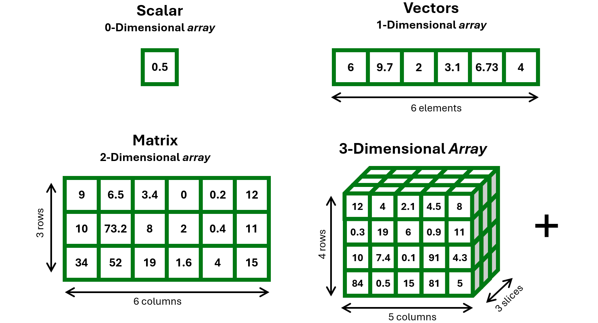

```{r, echo=F, include=F}
reticulate::use_python("C:/Users/enric/AppData/Local/Programs/Python/Python313/python.exe")
reticulate::repl_python()
```


## Why NumPy and Pandas?

Most data science pipelines in Python rely on these two packages, as base Python lacks built-in data structures like *vectors* with vectorized operations, *matrices* / *arrays*, and *data frames*

<div style="font-size:42px;">
- `numpy`: efficient numerical computing (homogeneous arrays, vectorized operations) and many math, algebraic, and basic statistical functions;
- `pandas`: fundamental data structures for tabular data (DataFrames), with convenient indexing, reshaping, and data manipulation tools;
</div>

<!--------------------------------------------------------------------->

## NumPy arrays

Remember the concept of "array" from <a href="https://enricotoffalini.github.io/Basics-R/" target="_blank">*Basics of R for Data Science*</a>?

<div style="text-align: center;">
  
</div>

<!--------------------------------------------------------------------->

## NumPy arrays

```{python}
import numpy as np
```

Example of 1-D array
```{python}
x = np.array( [6, 9.7, 2, 3.1, 6.73, 4] )
x
```

Example of 2-D array (aka matrix, structured as a list of equally-long lists)
```{python}
x = np.array( [[9, 6.5, 3.4, 0, 0.2, 12], 
               [10, 73.2, 8, 2, 0.4, 11], 
               [34, 52, 19,  1.6, 4, 15 ]] )
x
```

<!--------------------------------------------------------------------->

## Arrays: Vectorized Operations

Unlike basic lists, arrays are **homogenous** and support **fast vectorized operations**, e.g., `np.sqrt(x)`, `x+5`, `x**2`,  etc.

```{python}
x * 10
```

Different ways of doing the same thing:

```{python}
np.round(np.sqrt(x), 4)
```

```{python}
np.sqrt(x).round(4)
```

<!--------------------------------------------------------------------->

## Arrays: Vectorized Operations

```{python}
ar1 = np.array([1, 2, 3, 4])

ar2 = np.array([5, 6, 7, 8])

print(ar1 + ar2)       # element-wise addition
print(ar1 * ar2)       # element-wise multiplication
print(np.dot(ar1, ar2)) # dot product
```

These features make `np.array()` conceptually very similar to the `c()` and `array()` objects of R. However, as we will see, `np.array()` is stricter in enforcing data types

<!--------------------------------------------------------------------->

## Arrays: Structural attributes

What you can inspect for an array: 
```{python}
x.shape    # tuple of sizes of dimensions
x.ndim     # just the number of dimensions
x.size     # total number of elements
x.itemsize # memory size in bytes taken by a single element
x.nbytes   # total number of memory bytes occupied by the array
x.dtype    # data type of the array
```

<!--------------------------------------------------------------------->

## Arrays: Data types

```{python}
x = np.array([1.51, 2/3, 10, 14, 0.6])
x.dtype
x = np.array([24, 161, 10, 14, 188])
x.dtype
x = np.array(["aa","bb","cc","dd","❤❤"])
x.dtype
x = np.array(["Hello world!","bb","cc","dd","❤❤"])
x.dtype
x = np.array(["uselessly long string","bb","cc","dd","❤❤"])
x.dtype
```

<!--------------------------------------------------------------------->

## Arrays: Data type coercion

::: {.columns}
::: {.column width="50%"}
**Python numpy**
```{python}
x = np.array([10,11,12,13,14])
x[0] = 3.14159
x
```
:::
::: {.column width="50%"}
**R**
```{r}
x = c(10,11,12,13,14)
x[1] = 3.14159
x
```
:::
:::

Even with characters!

::: {.columns}
::: {.column width="50%"}
```{python}
x = np.array(["aa","bb","cc","dd","ee"])
x[0] = "Hello world!"
x
```
:::
::: {.column width="50%"}
```{r}
x = c("aa","bb","cc","dd","ee")
x[1] = "Hello world!"
x
```
:::
:::

<div style="text-align:center; font-size:75px;">😱</div>

<!--------------------------------------------------------------------->

## Arrays: Data type coercion

Actually, this "problem" is part of the secret of what makes Python **`numpy`** so **efficient**... **but be careful**!

How do you avoid this silent coercion? Explicitly state the data type from the beginning!

```{python}
x = np.array([10,11,12,13,14], dtype="float64")
x[0] = 3.14159
x
```

```{python}
x = np.array(["aa","bb","cc","dd","ee"], dtype="<U40")
x[0] = "Hello world!"
x
```

<!--------------------------------------------------------------------->

## Arrays: Slicing and Indexing

```{python}
x = np.array([10, 20, 30, 40, 50])
x[0]     # first element
x[-1]    # last element
x[1:4]   # elements 1 to 3
```

```{python}
x = np.array([[1,2,3,4], 
              [5,6,7,8]])
x[1,0]     # 2nd row, 1st column
x[-1,-1]   # last row, last column
x[0,]      # 1st row, all columns
```

<!--------------------------------------------------------------------->

## `Pandas` Series

`Series` are essentially like 1D `numpy arrays`, but labelled with keys (numerical indexing is deprecated for `Series`)

```{python}
import pandas as pd
grades = pd.Series([28, 15, 30, 23], index=["Jane", "Jim", "John", "Jack"])

print( grades["Jack"] )
print( grades[grades >= 18] )
print( grades[["Jack","Jane"]] )
```

<!--------------------------------------------------------------------->

## `Pandas` DataFrame ❤️

`pandas DataFrame` is the classical tabular object we are familiar with; can be seen as a special type of Python `dict` *(dictionary)*, composed of **internally-homogeneous, equally-long, labelled lists**

```{python}
myDF = pd.DataFrame( {
    "teacher": ["Pastore", "Granziol", "Feraco", "Altoe", "Marci"],
    "course": ["CurrentIssues", "BasicsInference", "SEM", "Outliers", "QMP"],
    "hours": [10, 20, 20, 5, 5],
    "mandatory": [True, True, False, False, True],
    "semester": [1, 1, 2, 2, 2]
 } , index=["t1","t2","t3","t4","t5"])
myDF
```

<!--------------------------------------------------------------------->

## DataFrame: Inspecting

::: {.columns}
::: {.column width="50%"}
```{python}
myDF.shape      # rows x columns
myDF.columns    # column names
myDF.info()     # structure
```
:::
::: {.column width="50%"}
```{python}
myDF.dtypes     # data types
myDF.describe() # summary stats
```
<span style="font-size:24px;">*about equivalent to `str()` and `summary()` in R*</span>
:::
:::

<!--------------------------------------------------------------------->

## DataFrame: Indexing columns

```{python, echo=F}
myDF
```

<div class="large-code">
::: {.columns}
::: {.column width="50%"}
Using general syntax: **`[ ]`**
```{python}
myDF["teacher"]
```
:::
::: {.column width="50%"}
Using *dot notation*
```{python}
myDF.teacher 
```
:::
:::
</div>

<!--------------------------------------------------------------------->

## DataFrame: Indexing columns + row slicing

```{python, echo=F}
myDF
```

<div class="large-code">
Combine column selection with row selection
```{python}
myDF["teacher"][0:3]
```
</div>

<!--------------------------------------------------------------------->

## DataFrame: Indexing multiple columns

```{python, echo=F}
myDF
```

<div class="large-code">

Use a list of column names inside the brackets 

```{python}
myDF[["teacher","course"]]
```

</div>

<!--------------------------------------------------------------------->

## DataFrame: Indexing columns + row slicing

```{python, echo=F}
myDF
```

<div class="large-code">
Combine column selection with row selection
```{python}
myDF[["teacher","course"]][0:3]
```
</div>

<!--------------------------------------------------------------------->

## DataFrame: Indexing rows

```{python, echo=F}
myDF
```

<div class="large-code">
::: {.columns}
::: {.column width="50%"}
Access rows by position
```{python}
myDF.iloc[0]
```
:::
::: {.column width="50%"}
Access rows by labels
```{python}
myDF.loc["t1"]
```
:::
:::
</div>

<!--------------------------------------------------------------------->

## DataFrame: Indexing multiple rows

```{python, echo=F}
myDF
```

<div class="large-code">
::: {.columns}
::: {.column width="50%"}
Access rows by position
```{python}
myDF.iloc[0:2]
```
:::
::: {.column width="50%"}
Access rows by labels
```{python}
myDF.loc[["t1","t2"]]
```
:::
:::
</div>

<!--------------------------------------------------------------------->

## DataFrame: Indexing rows + columns

```{python, echo=F}
myDF
```

<div class="large-code">
::: {.columns}
::: {.column width="50%"}
Access rows *and* columns
```{python}
myDF.loc["t1", "teacher"]
```
:::
::: {.column width="50%"}
Access rows *and* columns
```{python}
myDF.iloc[0, 0]
```
:::
:::
</div>
<br/>
*this is very similar to indexing using* `myDF[0,0]` *or* `myDF[0,"teacher"]` *in R*

<!--------------------------------------------------------------------->

## DataFrame: Indexing rows + columns

If you don't like the row **index, drop it!**

```{python}
myDF = myDF.reset_index(drop=True)
myDF
```

<div class="large-code">
```{python}
myDF.loc[0, "teacher"]
```
</div>
<br/>
*by default, rows have no names, and row names are not strictly needed in a DataFrame; without names, integer are used for indexing rows even using *`.loc[]`, *which makes it more similar to R*

<!--------------------------------------------------------------------->

## DataFrame Logical indexing

```{python, echo=F}         
myDF
```

```{python}
myDF[ myDF["hours"] > 15 ]
myDF[ myDF["teacher"] == "Pastore" ]
myDF[ (myDF["hours"] > 5) & (myDF["mandatory"] == True) ]
```

<!--------------------------------------------------------------------->

## DataFrame Logical indexing

```{python, echo=F}         
myDF
```

```{python}
myDF[ myDF["hours"] > 15 ][["teacher","course"]]
myDF[ myDF["teacher"] == "Pastore" ][["teacher","course"]]
myDF[ (myDF["hours"] > 5) & (myDF["mandatory"] == True) ][["teacher","course"]]
```

<!--------------------------------------------------------------------->

## DataFrame Logical indexing

```{python, echo=F}         
myDF
```

```{python}
myDF.loc[ myDF["hours"] > 15 , ["teacher","course"]]
myDF.loc[ myDF["teacher"] == "Pastore" , ["teacher","course"]]
myDF.loc[ (myDF["hours"] > 5) & (myDF["mandatory"] == True) , ["teacher","course"]]
```

Actually, this is the most recommended! especially for data manipulation

<!--------------------------------------------------------------------->

## Add new Columns in a DataFrame

```{python, echo=F}         
myDF
```

<div class="large-code">
Just index a column that doesn't exist... and fill it!
```{python}
myDF["wellBoh"] = 10
myDF
```
</div>

<!--------------------------------------------------------------------->

## Add new Columns in a DataFrame

```{python, echo=F}         
myDF.drop("wellBoh",axis=1)
```

<div class="large-code">
Just index a column that doesn't exist... and fill it!
```{python}
myDF["wellBoh"] = np.random.normal(size=len(myDF)).round(3)
myDF
```
</div>

<!--------------------------------------------------------------------->

## Modify Columns in a DataFrame

```{python}
myDF["wellBoh"] = myDF["wellBoh"] + 50 
myDF
```

```{python}
myDF.loc[myDF["hours"]>15, "wellBoh"] += 100000
myDF
```

<!--------------------------------------------------------------------->

## DataFrame (`Python pandas`) vs data.frame (`R`)

<div style="font-size:26px;">
| Task               | Python (`pandas`)     | R                   |
|--------------------|------------------------|----------------------|
| Select column      | `df["var"]`            | `df["var"]`          |
| Select column      | `df.var`               | `df$var`          |
| Multiple columns  | `df[["a", "b"]]`  | `df[, c("a", "b")]` |
| Filter rows        | `df[df["var"] > 0]`      | `df[df$var > 0, ]`     |
| Add column         | `df["newVar"] = ...`        | `df$newVar = ...`        |
| Modify column         | `df["var"] = df["var"]+10` <br/> `df["var"] += 10`    | `df$var = df$var+10`        |
| Summary            | `df.describe()`       | `summary(df)`        |
| Row access         | `df.loc[0]`           | `df[1, ]`            |
| Cell access        | `df.loc[0, "var"]`    | `df[1, "var"]`       |
| Cell access        | `df.iloc[0, 2]`       | `df[1, 3]`       |
</div>

<!--------------------------------------------------------------------->

## Merging DataFrames (with `pd.merge()`)

::: {.columns}
::: {.column width="56%"}
```{python}         
df1 = pd.DataFrame({
  "ID": ["Jane", "Jim", "John", "Jack"],
  "department": ["dpg","dpg","dpss","dpss"],
  "age": [21.4, 22.5, 20.2, 23.0]
})
df1

df2 = pd.DataFrame({
  "ID": ["Jim", "Jack", "John", "Jane"],
  "grade": [28, 15, 30, 23]
})
df2
```
:::
::: {.column width="44%"}
```{python}
df = pd.merge(df1, df2, on="ID")
df
```
<br/>
<div style="font-size:22px;">*be careful! it will lose any row that does not match across both DataFrames by `"name"`! otherwise, add argument `how="outer"` to keep all values and possibly fill with `NaN` (missing values)*</div>
:::
:::

<!--------------------------------------------------------------------->

## Concat. DataFrames (with `pd.concat()`)

::: {.columns}
::: {.column width="56%"}
```{python}         
dfDPG = pd.DataFrame({
  "name": ["Jane", "Jim"],
  "grade": [28, 15],
  "department": ["dpg", "dpg"]
})
dfDPG

dfDPSS = pd.DataFrame({
  "name": ["John", "Jack"],
  "grade": [30, 23],
  "department": ["dpss", "dpss"]
})
dfDPSS
```
:::
::: {.column width="44%"}
```{python}
df = pd.concat([dfDPG, dfDPSS])
df
```
<br/>
<div style="font-size:22px;">*this is much like `rbind()` in R, but using the argument `axis` may also work like the function `cbind()`*</div>
:::
:::

<!--------------------------------------------------------------------->

## Reshape Wide → Long (with `.melt()`)

```{python}
dfWide = pd.DataFrame({
  "ID": ["id01", "id02", "id03"],
  "gender": ["m", "m", "f"],
  "T0": [-2.31, -1.70, -2.64],
  "T1": [-1.50, -0.86, -2.30]
})
dfWide

dfLong = dfWide.melt(id_vars=["ID","gender"], var_name="TIME", 
                                value_name="SCORE", value_vars=["T0","T1"])
dfLong
```

<!--------------------------------------------------------------------->

## Reshape Long → Wide (with `.pivot()`)

```{python}
dfLong = pd.DataFrame({
  "ID": ["id01", "id01", "id02", "id02", "id03", "id03"],
  "gender": ["m", "m", "m", "m", "f", "f"],
  "TIME": ["T0", "T1", "T0", "T1", "T0", "T1"],
  "SCORE": [-2.31, -1.50, -1.70, -0.86, -2.64, -2.30]
}); dfLong

dfWide = dfLong.pivot(index=["ID","gender"], 
                           columns="TIME", values="SCORE").reset_index()
dfWide
```

<!--------------------------------------------------------------------->

## Grouped operations (with `.groupby()`)

```{python, echo=F}
myDF
```

<div class="large-code">
#### Count by group
```{python}
myDF.groupby("mandatory").size()
```

#### Average or sum by group
```{python}
myDF.groupby("semester")["hours"].mean()
```
</div>

<!--------------------------------------------------------------------->

## Grouped operations (with `.groupby()`)

#### Average multiple columns by group
<div class="large-code">
```{python}
myDF.groupby("semester")[["hours","wellBoh"]].mean()
```

#### Apply multiple functions with `.agg()`
```{python}
myDF.groupby("semester").agg({"hours": ["mean","std","min","max"],
                               "wellBoh": ["mean","std","median"]
                                }).round(2)
```
</div>

<!--------------------------------------------------------------------->
