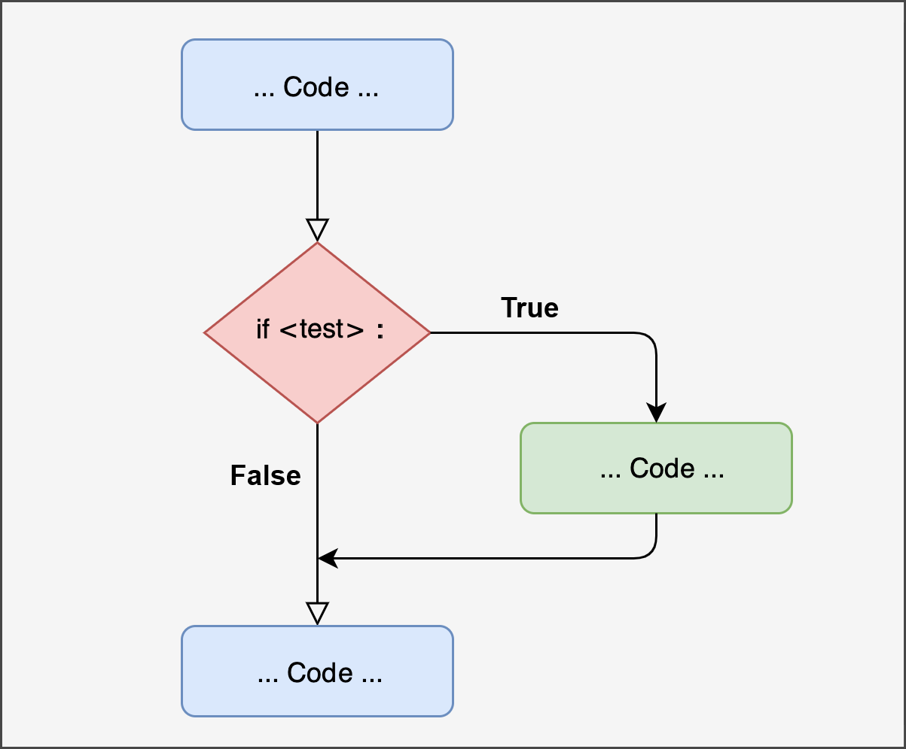
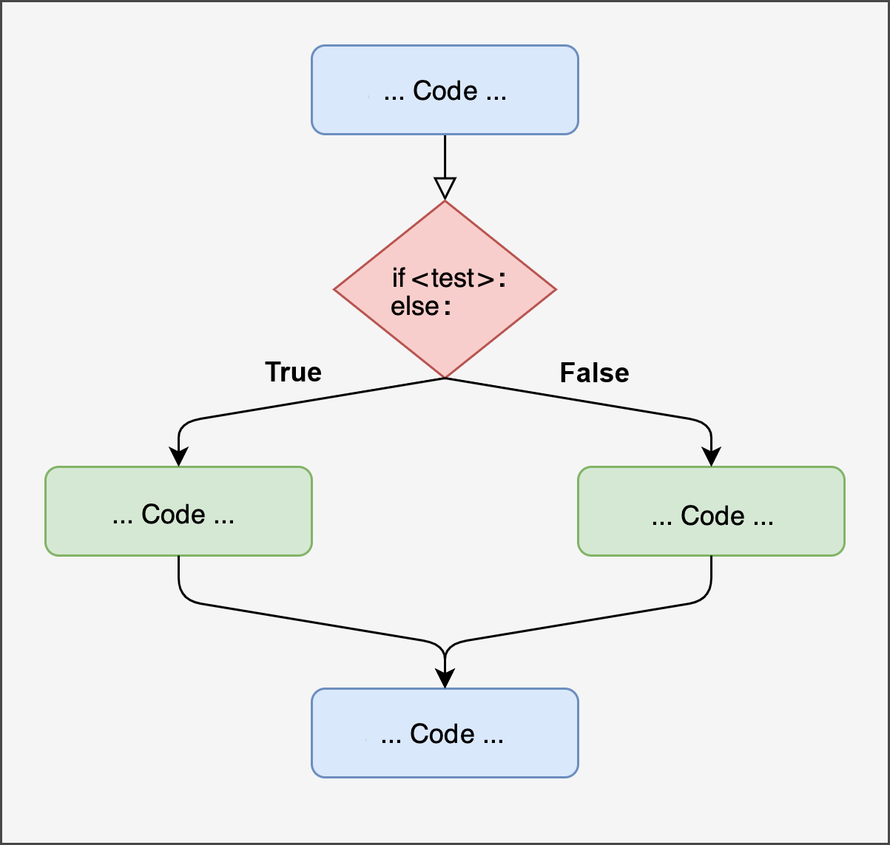

```{r, include=F, echo=F}
reticulate::use_python("C:/Users/enric/AppData/Local/Programs/Python/Python313/python.exe")
reticulate::repl_python()
```


## **`if`** statement

automatically make decisions based on boolean value of a condition

<div style="text-align: center;">
  
</div>

<!--------------------------------------------------------------->

## Conditional Programming

The logic closely resembles that in R, except that Python uses indentation (**not** curly or round brackets) to define blocks of code

<hr/>

### **`if`** statement

Performs an action *only if* a condition is met:

<div class="large-code">
```{python}
age = 20

if age >= 18:
    print("Adult")
```
</div> 


<!--------------------------------------------------------------->

## `if...else` statement

Sometimes you need to perform *alternative, mutually-exclusive* actions: 

<div style="text-align: center;">
  
</div>

<!--------------------------------------------------------------->

## `if...else` statement

<div class="large-code">
```{python}
#| results: 'hold'
age = 15

if age >= 18:
    print("Adult")
else:
    print("Minor")
```
</div>

Note that **indentation** is really important!

<div class="large-code">
```{python, error=T}
#| results: 'hold'
age = 15

if age >= 18:
    print("Adult")
else:
print("Minor")
```
</div>

<!--------------------------------------------------------------->

## `if...elif...else` statement

When you need to evaluate more than just two alternative conditions, you can use sort of *nested conditional statements* with with `if...elif...else`

<div class="large-code">
```{python}
age = 10

if age >= 18:
    print("Adult")
elif age >= 13:
    print("Adolescent")
elif age >= 2:
    print("Child")
else:
    print("Infant")
```
</div>

<!--------------------------------------------------------------->

## Example: Preplanned Analysis

Example of **automated decision** in a hypothetical **pre-registered analysis pipeline**:

```{python}
import numpy as np
import scipy.stats as st

x1 = np.random.normal(0, 1, size=30)
x2 = np.random.normal(0.5, 1, size=30)

tt = st.ttest_ind(x1, x2)
pval = tt.pvalue.round(4)
print(pval)

if pval < 0.05:
    print("Significant result: proceeding with follow-up analysis")
    # Here you could perform other analyses after the preliminary check
else:
    print("No significant result: reporting preliminary test only")
```

<!--------------------------------------------------------------->

## 
### Vectorized and Nested conditions

All previous examples evaluated **a single statement** that may be **`True`** or **`False`**. However, you often want to apply this operation to an entire vector

<div class="large-code">
```{python, error=T}
agesVector = np.array([2, 28, 15, 11, 4, 67, 0, 42, 14, 8])

if agesVector >= 18:
    print("Adult")
else:
    print("Minor")
```
</div>
<div style="font-size:25px">
*the error message suggests that I might use `np.any(agesVector >= 18)` or `np.all(agesVector >= 18)`, but this is not what I want! What I want is actually an `if...else` that evaluates across a whole vector of `True`s and `False`s (which should be like the `ifelse()` in R)*
</div>

<!--------------------------------------------------------------->

## 
### Vectorized and Nested conditions

You could use ***list comprehension*** (more on this later!), but it's a bit **painful to write**, **less readable**, and **slower** (for large data)...

<div class="large-code">
```{python, error=T}
agesVector = np.array([2, 28, 15, 11, 4, 67, 0, 42, 14, 8])

["adult" if age >= 18 else "minor" for age in agesVector]
```
</div>

<!--------------------------------------------------------------->

## 
### Vectorized and Nested conditions with `np.where()` and `np.select()`

<div class="large-code">
```{python}
agesVector = np.array([2, 28, 15, 11, 4, 67, 0, 42, 14, 8])

np.where(agesVector >= 18, "Adult", "Minor")
```
</div>
<span style="font-size:26px;">↳ *manages one single condition, similar to `ifelse()` in R*</span>

<div class="large-code">
```{python}
conditions = [agesVector >= 18, agesVector >= 13, 
                            agesVector >= 2, agesVector >= 0]
choices = ["Adult", "Adolescent", "Child", "Infant"]

np.select(conditions, choices, default="")
```
</div>
<span style="font-size:26px;">↳ *manages multiple nested conditions; no direct equivalent in R, maybe `dplyr::case_when()`*</span>

<!-- --------------------------------------------------------------------- -->

## Loops in Python

Looping in Python is used to repeat actions: `for` and `while` are most common

::: {.columns}
::: {.column width="50%"}
### `for` loop basics
<div class="large-code">
```{python}
for i in range(5):
    print(i)

for i in range(5):
    print(i**2)
```
</div>
:::
::: {.column width="50%"}
### Time-based iteration
<div class="large-code">
```{python, cache=T}
import time

for i in range(5):
    print(time.time())
    time.sleep(1)
```
</div>
:::
:::

<!--------------------------------------------------------------->

## Monte Carlo Simulation 😃

Repeat a data simulation to estimate the *standard error of the mean*:

```{python}
import numpy as np

N = 30
niter = 10
np.random.seed(0) # set seed for reproducibility: best practice! 
results = np.empty(niter) # initialize empty vector: best practice!

for i in range(niter):
    x = np.random.normal(size=N)
    results[i] = x.mean()

print( results.round(4) )
print( np.std(results).round(4) )
```

<!--------------------------------------------------------------->

## Monte Carlo Simulation 😃
::: {.columns}
::: {.column width="50%"}
```{python}
# STEP 1: RUN SIMULATION

import numpy as np

N = 30
niter = 10000

np.random.seed(0)
results = np.empty(niter) 

for i in range(niter):
    x = np.random.normal(size=N)
    results[i] = x.mean()

# STEP 2: ESTIMATE STANDARD ERROR

print( np.std(results).round(4) )
```
:::
::: {.column width="50%"}
```{python}
# STEP 3: PLOT RESULTS

import matplotlib.pyplot as plt

plt.hist(results, bins=50)

plt.xticks(fontsize=16);
plt.xlabel("mean",fontsize=16)

plt.show()
```
:::
:::

<!--------------------------------------------------------------->

## Iterating over Elements

Iterating over a sequence of integers (e.g., “`i in range(niter)`” is a common practice, however you could also iterate directly over the elements of a *List* or other data structures

```{python}
words = ["this", "is", "a", "vector", "of", "strings"]

for w in words:
    print(w.upper()*4)
```

***List comprehension*** is another, compact type of *for* loop over list elements:
```{python}
[w.upper()*2 for w in words]
```

<!--------------------------------------------------------------->

## `while` loop

The `while` loop is another classical type of iterative structure. It is useful when the precise number of iterations is unknown *a priori*, and depends on a condition becoming `True`

```{python}
amount = 1000
month = 0
interest_rate = 0.001

while amount < 1500:
    month += 1
    amount += amount * interest_rate

print(month)
```
<div style="font-size:24px;">➜ *it takes 406 months to reach an amount of €$1,500$ when starting with an amount of €$1,000$ with a 0.1% monthly interest rate*</div>

<!--------------------------------------------------------------->

## `break` in loops

The `break` command allows to interrupt any loop based on a condition

```{python}
import time
import scipy.stats as st

i = 0
pval = 1
Start = time.time()
while pval >= 0.001: # go on until p < 0.001
  i += 1
  x1 = np.random.normal(0,1,size=30)
  x2 = np.random.normal(0,1,size=30)
  tt = st.ttest_ind(x1, x2)
  pval = tt.pvalue
  Now = time.time()
  if Now - Start > 10: 
    break            # however, stop if overall time exceeds 10 seconds
print([i, pval.round(4)])
```

<!--------------------------------------------------------------->

##  Other iteration: `for` with `zip()`

**`zip()`** pairs elements across multiple sequences while iterating them

<div class="large-code">
::: {.columns}
::: {.column width="42%"}
```{python}
numbers = [5, 10, 10, 2, 7]


for n in numbers:
   print(n**2)
```
:::
::: {.column width="58%"}
```{python}
numbers = [5, 10, 10, 2, 7]
exponents = [2, 1, 5, 3, 1]

for n, e in zip(numbers, exponents):
   print(n**e)
```
:::
:::
</div>

<div class="large-code">
```{python}
[n**e for n, e in zip(numbers, exponents)]
```
</div>

<div style="font-size:24px;"><em>but note that the latter could be obtained much more easily with `numpy` vectorized operations: <b>`np.array(base) ** np.array(exponent)`</b></em></div>

<!--------------------------------------------------------------->

##  Other iteration: `for` with `zip()`

**`zip()`** pairs elements across multiple sequences while iterating them

<div class="large-code">
```{python}
teacher = ["Pastore", "Granziol", "Feraco","Altoe"]
course = ["CurrentIssues", "BasicsInference", "SEM","Outliers"]
hours = [10, 20, 20, 5]

for t, c, h in zip(teacher, course, hours):
   print(f"{t} teaches {c} which has {h} hours") # formatted-string
```
</div>

<!--------------------------------------------------------------->

##  Other iteration: `for` with `zip()`

`zip()` is very convenient, but if really you don't like it, you could do the same task using the classical numerical iterator **`i`**

<div class="large-code">
```{python}
teacher = ["Pastore", "Granziol", "Feraco","Altoe"]
course = ["CurrentIssues", "BasicsInference", "SEM","Outliers"]
hours = [10, 20, 20, 5]

for i in range(len(teacher)):
   print(f"{teacher[i]} teaches {course[i]} which has {hours[i]} hours")
```
</div>

<!--------------------------------------------------------------->

## Other iteration: `map()`

**`map()`** applies a specific function to each item in a sequence:

<div class="large-code">
```{python}
result = map(len, ["apple", "banana", [1,2,3], "watermelon"]) 

list(result)
```
</div>

in `map()`, you need to use `list(...)` to actually generate the result, otherwise a non-evaluated "lazy" `map` object is obtained

`zip()` and `map()` are about equivalent to `lapply()`/`sapply()` in R

<!--------------------------------------------------------------->

## Custom Functions

Custom functions are widely used in Python for efficiently reusing chunks of code. *Define* your functions with **`def`**; the logic is very similar as in R:

```{python}
def zScore(vect):
     vect = np.array(vect)
     mu = np.mean(vect)
     sigma = np.std(vect)
     return ((vect - mu) / sigma)

a = [10, 14, 7.6, 18, 22, 50, 0.5]
b = [700, 131, 215, 133.2, 190, 4100, 108.9]
c = [-4.2, -10.2, 2, -15]

zScore(a).round(3)
zScore(b).round(3)
zScore(c).round(3)
```

<!--------------------------------------------------------------->

## Custom Functions with `def`

Let's elaborate the custom `zScore` function a little bit, adding another arguments that allows us to specify whether we want to ignore *missing values*:

```{python}
def zScore(vect, naIgnore=False):
     vect = np.array(vect)
     if naIgnore==True: 
           mu = np.nanmean(vect)
           sigma = np.nanstd(vect)
     else:
           mu = np.mean(vect)
           sigma = np.std(vect)
     return ((vect - mu) / sigma)


myVector = np.array([10, 14, 7.6, np.nan, 18, 22, 50, 0.5, np.nan, 1.4, 7])
zScore(myVector).round(2)
zScore(myVector, naIgnore=True).round(2)
```

<!--------------------------------------------------------------->

## *Supercompact* Custom Functions with `lambda`

**`lambda`** command allows you to define a function in a single line of code without `def` or `return`; it may be useful for quick transformation, but of course does not allow any complex "logic" / statement

<div class="large-code">
```{python}
myVector = np.array([10, 14, 7.6, 18, 22, 50, 0.5, 1.4, 7])

zScore = lambda x: (x - x.mean()) / x.std()

zScore(myVector)
```
</div>

<!--------------------------------------------------------------->

## Conditional programming: Python vs R

<div style="font-size:26px;">
| Task                          | Python                           | R                              |
|-----------------------|-----------------------------------|---------------------------------|
| basic if               | `if cond:`                        | `if(cond){ }`                 |
| if ... else                     | `if cond:`<br/>`else:`              | `if(cond){`<br/>`} else { }`          |
| Multiple conditions           | `if cond1:`<br/>`elif cond2:`<br/>`else:`                | `if(cond1){`<br/>`} else if(cond2){`<br/>`} else { }` |
| Block delimiter               | *indentation*                   | `{ }`                           |
| "*not*" elementwise        | `~cond`                           | `!cond`                        |
| Multiple checks           | `(a > 1) & (b < 5)`               | `(a > 1) & (b < 5)`            |
| Vectorized condition          | `np.where(conds, ifT, ifF)`            | `ifelse(conds, ifT, ifF)`           |
| Multiple/nested vectorized conditions  | `np.select([...], [...])`         | `dplyr::case_when()`          |

</div>

<!--------------------------------------------------------------->

## Loops and Functions: Python vs R

<div style="font-size:26px;">
| Task                          | Python                             | R                             |
|----------------------------|-------------------------------------|-------------------------------|
| Loop over integers            | `for i in range(n):`                | `for(i in 1:n){ }`           |
| Loop over elements            | `for a in A:`                    | `for(a in A){ }`           |
| While loop                    | `while cond:`                       | `while(cond){ }`             |
| Block delimiter               | *indentation*                   | `{ }`                           |
| Break loop                | `break`                             | `break`                       |
| Apply function (list)         | `list(map(func, A))`              | `lapply(A, func)`           |
| Multilist iteration            | `for a, b in zip(A, B):`            | `mapply(FUN, A, B)`           |
| List comprehension            | `[func(a) for a in A]`              | `lapply(...)`|
| Function       | `def myFunc(a):`<br/><span style="color:rgba(0, 0, 0, 0);">_____</span>`...`<br/><span style="color:rgba(0, 0, 0, 0);">_____</span>`return ...`                     | `myFunc = function(a){ ... return(...)`<br/>`}`           |
| Supercompact function       | `lambda a: a + 1`                     | `function(a) a + 1`           |
</div>

<!--------------------------------------------------------------->

